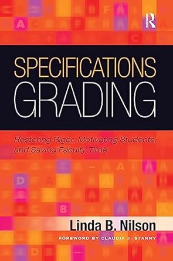

class: normal

```{r include=FALSE}
library(ggplot2)
filter <- dplyr::filter
knitr::opts_chunk$set(warning=FALSE, message=FALSE, fig.width=10.5, fig.height=4, 
  comment=NA, rows.print=16)
theme_set(theme_gray(base_size = 24))
```

## What is Specifications Grading?

.pull-left[

]

.pull-right[
* released in 2014
* I became aware of it via a colleague (at ICOTS!) in 2018
* tried it the following semester
* immediate convert to the **concept**
]

---

class: inverse

## testing

Specifications (or mastery-based) grading methods have become increasingly popular as assessment tools in education since the publication of Nilson's Specifications Grading: Restoring Rigor, Motivating Students, and Saving Faculty Time in 2015. This has extended to the mathematical, statistical and computational sciences, with numerous authors reporting success with assessments using this approach for laboratory sessions, calculus courses, and programming courses. Since 2019, I have implemented a series of variations on this theme across the statistics curriculum at Trent University (Ontario, Canada), which has resulted in significant perceived benefits on the part of students, and reported success in student learning outcomes and future knowledge retention. 

In this talk, I will discuss two variations implemented in two separate undergraduate statistics courses: Mathematical Statistics, and Linear Models. The first, Mathematical Statistics, has evolved three times since first implementation, and in its current iteration consists of a "pure" mastery system, with a large (45) number of pass/fail deliverables, which break down the course into the smallest atomic pieces feasible; each of these deliverables can be resubmitted once. The second, Linear Models, is a simplified system more appropriate for senior students, with dynamically chosen problem sets which can be resubmitted as many times as desired, but with each individual problem within the set being set to pass/fail, and a "best of" grade summary used. In both systems, the marking quantity is significantly increased, but the complexity of each unit of marking is dramatically decreased, resulting in approximately equivalent workloads as compared to more classic systems of assessment. I will discuss the outcomes from these experiments, from both the student and faculty point of view, with some thoughts on the difficulty of determining success in a change in assessment such as this. 


   
---

layout: false
class: inverse, middle

<center>
<a href="http://www.trentu.ca/math/"></a> &emsp;&emsp;
<a href="https://creativecommons.org/licenses/by/4.0/"></a>
</center>

## Contact Details

- Contact me: [Email](mailto:wesleyburr@trentu.ca) or [Twitter](https://twitter.com/wsburr)
- Slides created via the R package [xaringan](https://github.com/yihui/xaringan) by Yihui Xie
- Slides and source at <http://bit.ly/ozcots2023_wsb>
